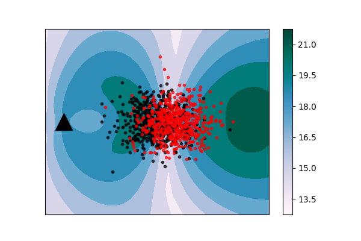

# Comparing distributions: l1 geometry improves kernel two-sample testing

Code of the paper by Meyer Scetbon and Gaël Varoquaux, NeurIPS 2019

## Intro: An L1 two-sample test

We consider two sample tests: given two samples independently and identically distributed (i.i.d.) according to two probability measures P and Q, the goal of a two-sample test is to decide whether P is different from Q on the basis of the samples. We take advantage of the L1 geometry and derive a finite dimensional approximation of a particular metric which captures differences between distributions at random locations. The locations can be chosen to maximize a lower bound on test power for a statistical test using these locations.

This repository contains a Python implementation of the L1-based tests presented in the [paper](https://arxiv.org/abs/1909.09264).

# Example

The figure below shows that test locations chosen via the optimization of
the proxy for the test power in the l1 case. These test locations are
informative for revealing the difference of the two samples. When one
location is fixed (black triangle) the proxy is maximized when the other
location is placed in the other region that captures the difference of
the two samples i.e., the region in which the probability masses of P and
Q have less overlap.

